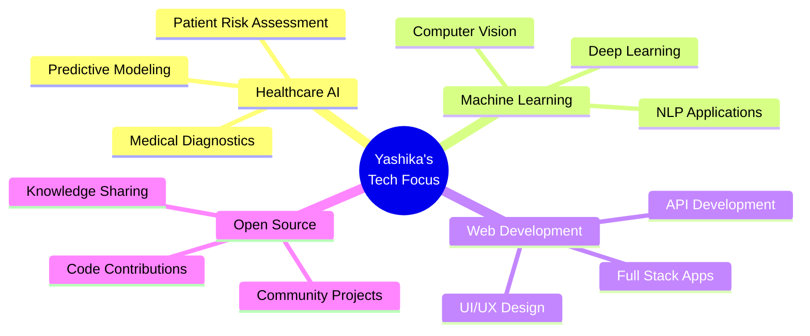

<div align="center">

# 👋 Hello World! I'm **Yashika Garg**

<div align="center">
  
</div>

[](https://github.com/yashika128)
[](https://github.com/yashika128)
[](https://github.com/yashika128)

</div>

---

## 🚀 **About Me**


```python
class YashikaGarg:
    def __init__(self):
        self.name = "Yashika Garg"
        self.role = "software developer"
        self.location = "India 🇮🇳"
        self.education = {
            "degree": "B.Tech Computer Science",
            "specialization": "Full stack development",
        }
        self.current_focus = [
            "Healthcare AI/ML Solutions",
            "Predictive Analytics",
            "Web Application Development",
            "Open Source Contributions"
        ]
        self.fun_fact = "I turn data into insights! 📊➡️💡"
    
    def say_hi(self):
        print("Thanks for dropping by! Let's build something amazing together! 🚀")

me = YashikaGarg()
me.say_hi()
```

### 🎯 **What Drives Me**
- 🧠 **Passionate** about developing AI solutions that solve real-world problems
- 🩺 **Focused** on healthcare technology and predictive analytics
- 🌱 **Constantly** learning cutting-edge technologies and methodologies
- 🤝 **Committed** to open-source contributions and knowledge sharing
- 📊 **Enthusiastic** about turning complex data into actionable insights

---

## 💻 **Tech Stack**

<div align="center">

### **Programming Languages**


### **AI/ML & Data Science**


### **Web Technologies**


### **Tools & Platforms**


### **Software Developer Tools**


</div>

---

## 📊 **GitHub Analytics**

<div align="center">
  


</div>

<div align="center">
  


</div>

---

## 🏆 **Featured Projects**

<div align="center">

### 🩺 **Diabetes Prediction System**
[](https://github.com/yashika128/diabetes-prediction)

**🎯 Key Features:**
- Multi-algorithm ML comparison (Random Forest, SVM, Logistic Regression, KNN)
- SMOTE for class balancing & 5-fold cross-validation
- Flask web application with responsive UI
- Real-time health risk assessment

**🛠️ Tech Stack:** `Python` `scikit-learn` `Flask` `HTML/CSS` `Pandas` `NumPy`

---

### 📈 **More Amazing Projects Coming Soon...**
*Stay tuned for more innovative AI/ML solutions!* 🚀

</div>

---

## 🎯 **Current Focus Areas**

<div align="center">



</div>

---

## 🏅 **Achievements & Certifications**

<div align="center">

| 🏆 Achievement | 📅 Year | 🏢 Organization |
|:---------------|:--------|:----------------|
| 💻 **Full Stack Development Specialization** | 2024 |  University Program|
| 🤝 **Open Source Contributor** | 2024 | GitHub Community |
| 🎓 **AI/ML** | 2024 | Self-Directed Learning |
| 🏥 **Healthcare Technology Project** | 2024 | Academic Excellence |


</div>

---

## 📈 **2024 Goals & Learning Journey**

<div align="center">

### 🎯 **This Year's Objectives**

```
🧠 Master Advanced ML Techniques    ████████████████████░ 90%
🩺 Develop Healthcare AI Solutions  ████████████████░░░░ 80%
🌐 Build Full-Stack Applications   ████████████████░░░░ 80%
📚 Contribute to Open Source       ███████████░░░░░░░░░ 60%
🚀 Launch Personal Tech Blog       █████░░░░░░░░░░░░░░░ 25%
```

</div>

---

## 🌟 **Fun Facts About Me**


- 🔢 **Data Enthusiast**: I can spend hours exploring datasets and finding hidden patterns
- 🧩 **Problem Solver**: Love turning complex challenges into elegant solutions
- 📚 **Continuous Learner**: Always reading about the latest in AI and technology
- 🎨 **Creative Coder**: Believe that code should be both functional and beautiful
- 🌱 **Growth Mindset**: Every bug is a learning opportunity in disguise
- ☕ **Coffee Powered**: Powered by curiosity and good coffee
- 🎯 **Detail Oriented**: Believe that small improvements lead to big breakthroughs

---

## 🤝 **Let's Connect & Collaborate**

<div align="center">

**I'm always excited to connect with fellow developers, researchers, and innovators!**

[](https://https://www.linkedin.com/in/yashika-garg-128b98333/)
[](mailto:yashikagarg638@gmail.com)
[](https://github.com/yashika128)
[](https://yashikagarg.dev)

### 💬 **Let's discuss:**
- 🧠 AI/ML projects and research
- 🩺 Healthcare technology innovations  
- 💻 Full-stack development best practices
- 🤖 Open source collaboration opportunities
- 📊 Data science methodologies

</div>

---

<div align="center">

## 🌟 **"Code is like humor. When you have to explain it, it's bad."** 
*– Cory House*

**Thanks for visiting my profile! Let's build the future together! 🚀**

 <em><b>Happy coding!</b> 😊</em>

---


⭐️ **From [Yashika Garg](https://github.com/yashika128) with ❤️**

</div>
